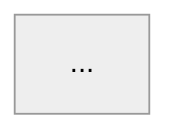

# RFC 0043: Mermaid Diagram Standards for Blue Documents

| | |
|---|---|
| **Status** | Accepted |
| **Created** | 2026-01-30 |
| **Spike** | [2026-01-30T1521Z-mermaid-diagram-style-guide](../spikes/2026-01-30T1521Z-mermaid-diagram-style-guide-for-blue-documents.done.md) |
| **Dialogue** | [2026-01-30T1730Z-rfc-0043-mermaid-diagram-standards](../dialogues/2026-01-30T1730Z-rfc-0043-mermaid-diagram-standards.dialogue.recorded.md) |

---

## Summary

Establish mandatory standards for Mermaid diagrams in all Blue-generated documents, ensuring readability in both light and dark modes through the `neutral` theme, vertical flow preference, and automated lint enforcement.

---

## Problem

Mermaid diagrams in Blue documents have inconsistent styling that causes readability issues:

1. **Dark mode incompatibility** — Custom fill colors (`#e8f5e9`, `#e3f2fd`) designed for light mode become unreadable in dark mode
2. **Invisible text** — Dark nodes with no explicit text color disappear against dark backgrounds
3. **Subgraph label contrast** — Colored subgraph backgrounds obscure labels
4. **Horizontal sprawl** — `flowchart LR` requires horizontal scrolling on narrow viewports
5. **No enforcement** — Authors must remember style rules manually

This affects:
- ADRs with architecture diagrams
- RFCs with system designs
- Dialogue recordings with flow visualizations
- Any document Blue generates containing Mermaid

---

## Proposal

### 1. Mandatory Theme Declaration

All Mermaid diagrams MUST begin with the neutral theme declaration:



### 2. Flow Direction Guidelines

| Direction | When to Use | Enforcement |
|-----------|-------------|-------------|
| `TB` (top-to-bottom) | Default for all diagrams | — |
| `LR` (left-to-right) | Only when ≤3 leaf nodes | Advisory warning |

The constraint is **horizontal space**. `LR` with 4+ nodes forces horizontal scrolling on narrow viewports.

**Node Counting**: Count leaf nodes (terminal visual elements), not container subgraphs. A diagram with 2 subgraphs each containing 4 nodes counts as 8 nodes for threshold purposes.

### 3. Prohibited Styling

The following are NOT ALLOWED:

```mermaid
%% PROHIBITED
style NODE fill:#e8f5e9
style NODE fill:#any-color
classDef custom fill:#color
```

The neutral theme provides sufficient visual distinction through grayscale shading.

### 4. Emoji Guidance

| Context | Emoji Allowed | Rationale |
|---------|---------------|-----------|
| Architecture component labels | **No** | Platform-dependent color rendering undermines neutral theme |
| Subgraph titles | **No** | Same dark-mode readability issues as custom fills |
| Annotations/comments | Yes | Non-critical context where variance is acceptable |

**Example**:
```mermaid
%% GOOD: Plain text architecture labels
subgraph SV["Superviber Control Plane"]
    ORCH["Orchestration"]
end

%% BAD: Emoji injects platform-dependent color
subgraph SV["☁️ Superviber Cloud"]
```

### 5. Recommended Shape Semantics

*Advisory for new diagrams. Legacy documents exempt.*

| Shape | Syntax | Semantic |
|-------|--------|----------|
| Rectangle | `[text]` | Services, components, processes |
| Rounded | `(text)` | User-facing elements, entry points |
| Database | `[(text)]` | Data stores, persistence |
| Stadium | `([text])` | External systems, third-party |
| Hexagon | `{{text}}` | Decision points, conditionals |
| Circle | `((text))` | Events, triggers |

### 6. Edge Label Guidelines

*Advisory, not prescriptive.*

- Recommended maximum: 15 characters
- Use abbreviations: `mTLS`, `gRPC`, `REST`
- Longer labels acceptable when clarity requires it

### 7. Lint Rule Enforcement

Extend `crates/blue-mcp/src/handlers/lint.rs` (existing infrastructure):

```rust
/// Mermaid diagram linting for Blue documents
fn check_mermaid_blocks(content: &str) -> Vec<Diagnostic> {
    let mut diagnostics = vec![];

    for block in extract_mermaid_blocks(content) {
        // REQUIRED: Neutral theme declaration
        if !block.contains("'theme': 'neutral'")
           && !block.contains("\"theme\": \"neutral\"") {
            diagnostics.push(Diagnostic {
                severity: Severity::Error,
                message: "Mermaid diagram must use neutral theme".into(),
                suggestion: Some("Add: %%{init: {'theme': 'neutral'}}%%".into()),
                auto_fix: Some(AutoFix::PrependLine(
                    "%%{init: {'theme': 'neutral'}}%%".into()
                )),
            });
        }

        // PROHIBITED: Custom fill colors (NO auto-fix - preserves semantic intent)
        if block.contains("fill:#") || block.contains("fill: #") {
            diagnostics.push(Diagnostic {
                severity: Severity::Error,
                message: "Custom fill colors prohibited in Mermaid diagrams".into(),
                suggestion: Some("Remove style directives manually; review semantic intent".into()),
                auto_fix: None, // Intentionally no auto-fix
            });
        }

        // ADVISORY: LR flow with >3 leaf nodes
        if block.contains("flowchart LR") || block.contains("graph LR") {
            let leaf_count = count_leaf_nodes(&block);
            if leaf_count > 3 {
                diagnostics.push(Diagnostic {
                    severity: Severity::Warning,
                    message: format!(
                        "LR flow with {} leaf nodes may cause horizontal scrolling",
                        leaf_count
                    ),
                    suggestion: Some("Consider flowchart TB for better viewport fit".into()),
                    auto_fix: None,
                });
            }
        }
    }

    diagnostics
}

/// Count leaf nodes (terminal visual elements, not container subgraphs)
fn count_leaf_nodes(mermaid_content: &str) -> usize {
    // Count node definitions: ID[label], ID(label), ID[(label)], etc.
    // Exclude: subgraph, end, style, classDef, linkStyle
    let node_pattern = regex::Regex::new(r"^\s*(\w+)\s*[\[\(\{\<]").unwrap();
    let exclude_keywords = ["subgraph", "end", "style", "classDef", "linkStyle"];

    mermaid_content
        .lines()
        .filter(|line| {
            let trimmed = line.trim();
            !exclude_keywords.iter().any(|kw| trimmed.starts_with(kw))
                && node_pattern.is_match(trimmed)
        })
        .count()
}
```

### 8. Template Integration

Update Blue's document templates to generate compliant Mermaid by default:

```rust
fn generate_mermaid_block(diagram_type: &str, content: &str) -> String {
    format!(
        "```mermaid\n%%{{init: {{'theme': 'neutral'}}}}%%\n{} TB\n{}\n```",
        diagram_type,
        content
    )
}
```

---

## Migration

### Auto-Fix Scope

| Issue | Auto-Fix | Rationale |
|-------|----------|-----------|
| Missing theme declaration | ✓ Yes | Non-destructive prepend |
| Custom fill colors | ✗ No | Preserves semantic intent; requires manual review |
| LR with >3 nodes | ✗ No | Advisory only; architectural choice |

### Migration Process

1. Run lint with `--fix` to auto-add theme declarations
2. Manual review for custom colors (lint reports, human decides)
3. Priority: ADRs > RFCs > Dialogues

### Implementation Track

Templates and lint can proceed in parallel:
- Templates: Generate compliant diagrams for new documents
- Lint: Flag violations in existing documents (warning-only mode during transition)

---

## Alternatives Considered

### A. `dark` Theme Only

**Rejected**: Looks poor in light mode. We need both-mode compatibility.

### B. `base` Theme with Custom Variables

**Rejected**: Requires verbose `themeVariables` block in every diagram. High maintenance burden.

### C. Pre-render to SVG at Build Time

**Rejected**: Loses live preview in editors. Adds build complexity.

### D. Documentation Only (No Enforcement)

**Rejected**: Relies on authors remembering. Inconsistency will creep back.

### E. New `blue_lint` Crate

**Rejected**: Existing lint infrastructure in `crates/blue-mcp/src/handlers/lint.rs` already handles RFC docs. Extend, don't duplicate.

---

## Success Criteria

1. All Mermaid diagrams pass `blue_lint` without errors
2. Diagrams readable in VS Code light theme, VS Code dark theme, GitHub light, GitHub dark
3. No custom `fill:#` directives in any Blue document
4. Template generates compliant diagrams by default
5. Lint runs in parallel with template development

---

## References

- [Spike: Mermaid Diagram Style Guide](../spikes/2026-01-30T1521Z-mermaid-diagram-style-guide-for-blue-documents.done.md)
- [Alignment Dialogue](../dialogues/2026-01-30T1730Z-rfc-0043-mermaid-diagram-standards.dialogue.recorded.md) — 10/10 tensions resolved
- [Mermaid Theming Documentation](https://mermaid.js.org/config/theming.html)
- [ADR 0005: Single Source of Truth](../adrs/0005-single-source.accepted.md)

---

## Tasks

- [ ] Extend `lint.rs` with Mermaid block extraction
- [ ] Implement theme declaration check with auto-fix
- [ ] Implement fill color check (error, no auto-fix)
- [ ] Implement leaf node counting for LR warning
- [ ] Update document generation templates
- [ ] Migrate existing diagrams in ADRs (manual color review)
- [ ] Migrate existing diagrams in RFCs (manual color review)
- [ ] Add Mermaid cheatsheet to `.blue/docs/`
