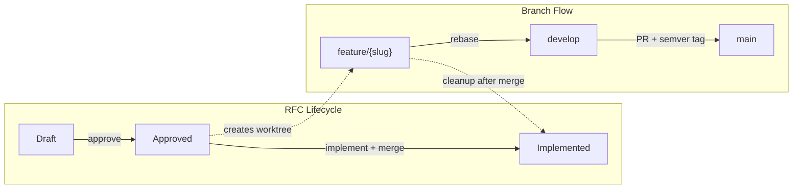
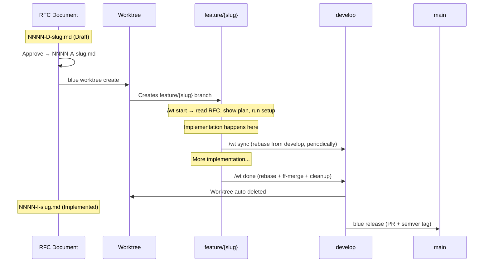

# RFC 0073: Branch Workflow Enforcement

**Status**: Implemented
**Created**: 2026-03-17
**Last Updated**: 2026-03-20

## Problem

Blue's workflow has informal branch and status conventions that aren't fully enforced. Implementation can start without approval, merges aren't consistently rebased, worktrees aren't always cleaned up, and there's no release ceremony from develop to main. The docs structure is stale (docs/mcp/ references removed MCP server).

## Decision

Enforce a strict, documented workflow:

1. **RFC status lifecycle**: Draft (D) → Approved (A) → Implemented (I)
2. **RFC file naming**: `NNNN-{D|A|I}-slug.md` (replaces `.{status}.md` suffix)
3. **Implementation gating**: Code changes require an Approved RFC + worktree
4. **Branch model**: `feature/{slug}` → rebase onto `develop` → PR to `main` with semver tag
5. **Worktree cleanup**: Auto-delete after merge to develop
6. **Guard enhancement**: Verify RFC approval status before allowing implementation
7. **Release skill**: New `blue release` command for develop→main with semver tagging

## Scope

### In Scope
- RFC naming convention migration (`.{status}.md` → `NNNN-{D|A|I}-slug.md`)
- Guard enhancement to check RFC approval status via blue.db
- Workflow status simplification (D/A/I)
- Worktree auto-cleanup after merge
- `blue release` command with semver tagging
- Documentation overhaul (`docs/workflow/` with mermaid diagrams)
- Remove stale docs (docs/mcp/, docs/divorce/)
- Clean up docs/cli/ and docs/patterns/ content

### Out of Scope
- CI/CD pipeline changes
- GitHub branch protection rules (manual setup)
- Multi-repo workflow coordination

## Approach

### RFC File Naming Convention

**Current**: `NNNN-slug.{status}.md` (e.g., `0072-remove-mcp-server.approved.md`)
**New**: `NNNN-{D|A|I}-slug.md` (e.g., `0072-A-remove-mcp-server.md`)

Status prefixes:
- `D` — Draft (proposal stage, open for discussion)
- `A` — Approved (accepted for implementation)
- `I` — Implemented (work complete, merged)

Superseded RFCs get an `S` prefix: `NNNN-S-slug.md`

### Branch Model





### Workflow Rules

| Rule | Enforced By |
|------|------------|
| No implementation without Approved RFC | Guard (filesystem glob for `*-A-*.md`) |
| Implementation only in worktrees | Guard (checks .git file vs dir) |
| Doc changes (RFCs, decisions, etc.) only on develop | Guard (blocks `.blue/docs/` writes in worktrees) |
| Feature branches use `feature/{slug}` | Worktree handler |
| All merges are rebases | `pull.rebase=true` via `blue init` |
| A→I transition only on develop | Workflow validator |
| Worktree deleted after merge | Cleanup handler (auto) |
| Release = develop→main with linear history | `blue release` (rebase + fast-forward + semver tag) |

### Guard Enhancement

Current guard checks:
- Is path in allowlist? → allow
- Is this a worktree? → allow if RFC worktree
- Is this main repo on feature branch? → allow
- Otherwise → block source code writes

**New additions:**
1. When in a worktree, **check the filesystem** for RFC approval status — glob `.blue/docs/rfcs/` for `*-A-{slug}.md` or `*-I-{slug}.md`
2. Block if only `*-D-{slug}.md` exists (must be Approved first)
3. **Block `.blue/docs/` writes in worktrees** — doc changes belong on develop, worktrees are implementation-only
4. A→I status transition blocked unless on develop branch

**Worktree = implementation only.** RFCs, decisions, lessons, and all doc changes happen on develop. The worktree is a clean sandbox for code. Its copy of `.blue/docs/rfcs/` stays current via rebase from develop, which is how the guard reads RFC approval status.

**Why filesystem, not DB?** The new naming convention (`NNNN-{D|A|I}-slug.md`) encodes status in the filename. After any rebase from develop, the filename is already updated — no DB query needed, no stale cache problem. This is the key insight that makes the naming convention load-bearing, not cosmetic.

**Cross-meeple sync flow:**
```
Meeple A: approve RFC → rename NNNN-D-slug.md → NNNN-A-slug.md → commit → push develop
Meeple B: git rebase develop → file is now NNNN-A-slug.md → guard sees it → allows implementation
```

### Git Config Enforcement

`blue init` sets the following in `.git/config`:
```
[pull]
    rebase = true
[rebase]
    autoStash = true
```

This ensures:
- Every `git pull` is a rebase (no merge commits)
- Dirty working trees are auto-stashed during rebase
- Applied per-repo (not global), set by `blue init` and `blue worktree create`

### Worktree Skill (`/wt`)

A Claude Code skill that standardizes the worktree workflow. Subcommands:

| Command | Purpose |
|---------|---------|
| `/wt start` | Detect worktree → find RFC from branch name → read RFC + plan → run dev setup if needed → show tasks |
| `/wt sync` | Rebase from develop, report conflicts if any |
| `/wt done` | Check clean tree → rebase onto develop → ff-merge → rename RFC to I on develop → delete worktree |
| `/wt status` | Show RFC title, branch, plan progress, commits ahead/behind develop |

**Session-start integration:** The existing session-start hook detects worktree context (`.git` is a file) and suggests `/wt start` automatically.

**`/wt start` flow:**
1. Parse branch name `feature/{slug}` to extract slug
2. Glob `.blue/docs/rfcs/*-A-{slug}.md` to find the RFC
3. Read RFC document and plan
4. Run `scripts/setup-worktree.sh` or auto-detected install command if first run
5. Display plan with task checklist and current progress

**`/wt done` flow:**
1. Check for uncommitted changes → warn and abort if dirty
2. `git rebase develop` (sync latest)
3. `git checkout develop && git merge --ff-only feature/{slug}`
4. Rename RFC: `NNNN-A-slug.md` → `NNNN-I-slug.md` (on develop)
5. Commit the rename
6. `git worktree remove` + delete local branch
7. Report completion

### Release Command

```
blue release [--major|--minor|--patch]
```

1. Ensure on develop branch, clean working tree
2. Determine next version from git tags (defaults to --patch)
3. Rebase develop onto main (ensure linear history)
4. Create PR: develop → main
5. Fast-forward merge (linear history preserved, no merge commits)
6. Tag with `vX.Y.Z` on main
7. Print release summary

## Phases

### Phase 1: RFC Naming Convention
- [ ] Update `workflow.rs` — simplify to D/A/I status model
- [ ] Update RFC document parser to handle new naming
- [ ] Migrate existing RFCs to new naming convention
- [ ] Update store/indexer for new naming

### Phase 2: Guard Enhancement
- [ ] Add filesystem glob to check RFC status from filename (`*-{A|I}-slug.md`)
- [ ] Block implementation writes if only `*-D-slug.md` exists for the worktree's RFC
- [ ] Block `.blue/docs/` writes in worktrees (docs belong on develop)
- [ ] Block A→I transition unless on develop branch
- [ ] Set `pull.rebase=true` and `rebase.autoStash=true` in `blue init` and worktree create

### Phase 3: Worktree Lifecycle
- [ ] Auto-cleanup worktree after successful merge to develop (warn + abort if uncommitted work)
- [ ] Auto-transition RFC status to Implemented on merge (rename on develop)
- [ ] Ensure `feature/{slug}` naming convention throughout
- [ ] Standardize worktree dev setup (`scripts/setup-worktree.sh` or auto-detect)
- [ ] Dev setup = dependency install + git config only (no blue init, no reindex — worktree is implementation-only)

### Phase 4: Worktree Skill
- [ ] Create `/wt` skill with `start`, `sync`, `done`, `status` subcommands
- [ ] `/wt start` — detect worktree, find RFC, read plan, run setup, show tasks
- [ ] `/wt sync` — rebase from develop with conflict reporting
- [ ] `/wt done` — dirty check, rebase, ff-merge, RFC rename to I, worktree cleanup
- [ ] `/wt status` — RFC info, branch, plan progress, commits ahead/behind
- [ ] Update session-start hook to detect worktree and suggest `/wt start`

### Phase 5: Release Command
- [ ] Implement `blue release` CLI command
- [ ] Semver tag auto-generation from git tags
- [ ] Rebase develop onto main, create PR, fast-forward merge
- [ ] Tag main with `vX.Y.Z` after merge
- [ ] Create `/lc-release` skill (optional)

### Phase 6: Documentation
- [ ] Remove `docs/mcp/` (dead per RFC 0072)
- [ ] Remove `docs/divorce/` (empty)
- [ ] Create `docs/workflow/README.md` with mermaid diagrams
- [ ] Update `docs/cli/README.md` with current commands
- [ ] Clean up `docs/patterns/` content
- [ ] Update main README.md workflow section

## Related
- [RFC 0007: Consistent Branch Naming](./0007-I-consistent-branch-naming.md)
- [RFC 0038: SDLC Workflow Discipline](./0038-D-sdlc-workflow-discipline.md)
- [RFC 0049: Synchronous Guard](./0049-I-synchronous-guard-command.md)
- [RFC 0072: Remove MCP Server](./0072-A-remove-mcp-server.md)

## Resolved Questions

| Question | Decision | Rationale |
|----------|----------|-----------|
| Should `blue release` auto-merge? | Yes — rebase + fast-forward merge | Keeps linear commit history, no merge commits |
| Enforce rebase at git config level? | Yes — `pull.rebase=true` + `rebase.autoStash=true` | Set by `blue init`, per-repo. Prevents accidental merge commits even outside blue commands |
| Guard: DB read vs cache vs filesystem? | Filesystem glob | New `NNNN-{D|A|I}-slug.md` naming makes status readable from filename. Always current after git pull/rebase. No DB dependency in hot path, no cache staleness |
| Worktree cleanup with uncommitted work? | Warn and abort | Never destroy uncommitted work. User must commit or stash before cleanup proceeds |

## Open Questions

None — all resolved.

## Notes
- The guard runs synchronously before tokio init (RFC 0049). Filesystem glob is lighter than the SQLite read we originally considered.
- Existing RFCs with `.{status}.md` naming will be batch-migrated in Phase 1.
- The `feature/` prefix is already used by the worktree handler — this RFC formalizes it as the only allowed pattern.
- The naming convention is load-bearing: it enables cross-meeple status sync without DB coordination.
