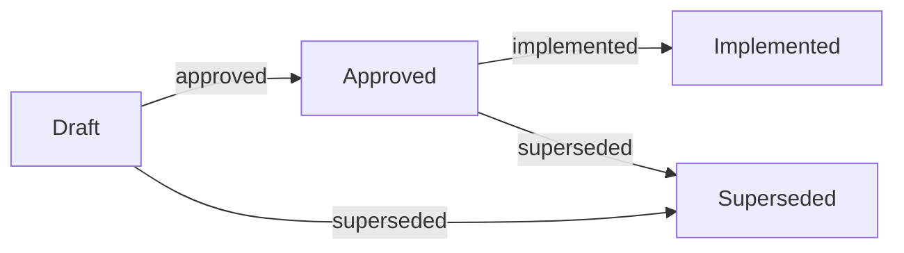
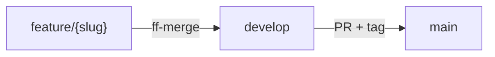
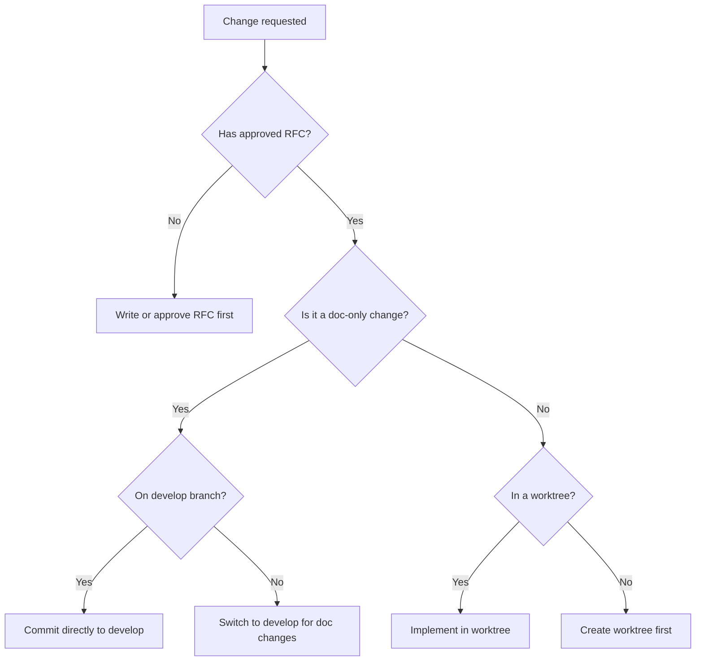
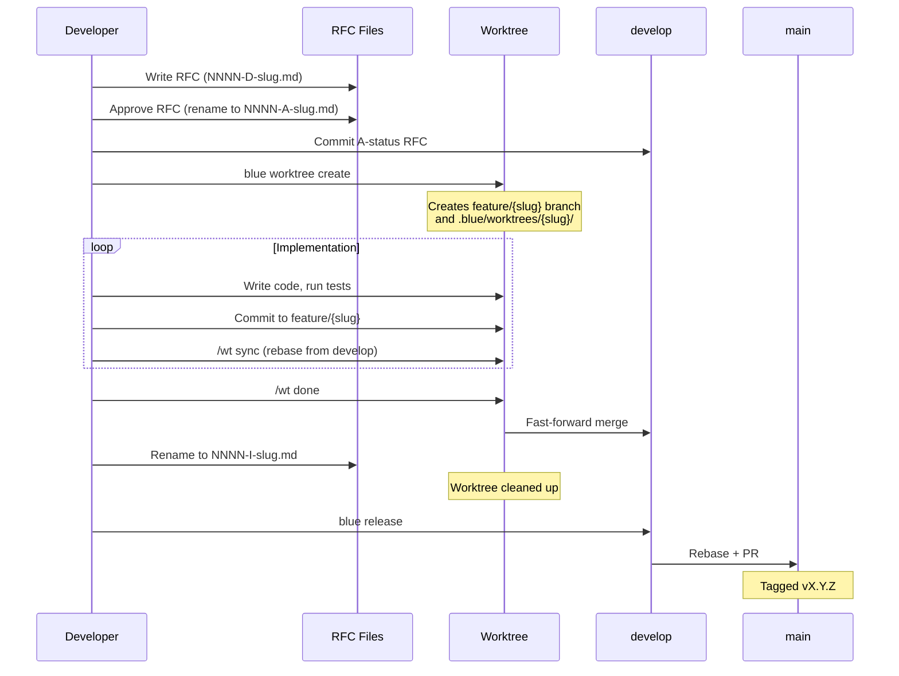

# Blue Workflow

How RFCs, branches, worktrees, and releases fit together.

## RFC Lifecycle

Every change begins as an RFC. The RFC status is encoded in its filename so that any meeple can see the current state without opening the file.

### Status Codes

| Code | Status | Meaning |
|------|--------|---------|
| `D` | Draft | Under discussion, not yet approved |
| `A` | Approved | Ready for implementation |
| `I` | Implemented | Merged into develop |
| `S` | Superseded | Replaced by a newer RFC |

### Filename Convention

```
NNNN-{D|A|I|S}-slug.md
```

Examples:
- `0073-D-branch-workflow-enforcement.md` -- draft, still being discussed
- `0073-A-branch-workflow-enforcement.md` -- approved, ready for a worktree
- `0073-I-branch-workflow-enforcement.md` -- implemented, merged to develop
- `0042-S-old-approach.md` -- superseded by a later RFC

The status letter is load-bearing. Cross-meeple sync depends on it: a meeple scanning filenames can immediately tell which RFCs are in flight, which are ready for work, and which are done.

### Status Flow



An RFC moves from Draft to Approved when the team agrees on the approach. It moves from Approved to Implemented when the feature branch lands on develop. At any point, an RFC can be marked Superseded if a better approach emerges.

## Branch Model

Blue uses a three-tier branch model with rebase-only merges.

```
main              (production releases only)
  ^
  | PR + semver tag
  |
develop           (integration branch, default)
  ^
  | fast-forward merge
  |
feature/{slug}    (implementation work)
```

### Rules

- All merges are rebases. Enforced via `pull.rebase=true` in git config.
- Feature branches merge into develop via fast-forward only (no merge commits).
- Develop merges into main via PR with a semver tag.
- Direct commits to main are not allowed.

### Branch Flow



## Worktree Lifecycle

Worktrees isolate implementation work from the develop branch. Each approved RFC gets its own worktree under `.blue/worktrees/`.

### Steps

1. **RFC gets approved.** Rename from `NNNN-D-slug.md` to `NNNN-A-slug.md` on develop.
2. **Create worktree.** Run `blue worktree create` to create a `feature/{slug}` branch and a working directory under `.blue/worktrees/{slug}`.
3. **Implement.** All code changes happen in the worktree. The develop branch stays clean for doc-only changes and other worktree merges.
4. **Sync periodically.** Run `/wt sync` to rebase the feature branch onto the latest develop, picking up work from other meeples.
5. **Finish.** Run `/wt done` to rebase onto develop, fast-forward merge, rename the RFC from `A` to `I`, and clean up the worktree.

### Guard Rules

These constraints keep the workflow consistent:

| Rule | Why |
|------|-----|
| No implementation without an Approved RFC | Every change is traceable to a decision |
| Implementation only in worktrees | Develop stays stable for integration |
| Doc-only changes on develop | Worktrees must not touch shared docs |
| A to I transition only on develop | Prevents status conflicts between meeples |

### Guard Decision Tree



## Full Workflow Sequence

This diagram shows the complete lifecycle from RFC creation through release.



## Release Process

Releases move completed work from develop to main.

1. Run `blue release` on the develop branch.
2. Blue rebases develop onto main.
3. A PR is created for review.
4. After approval, the PR is fast-forward merged.
5. The merge commit is tagged with the next semver version (`vX.Y.Z`).

### Version Bumping

- **Patch** (`v1.0.1`): Bug fixes, minor tweaks
- **Minor** (`v1.1.0`): New features, non-breaking changes
- **Major** (`v2.0.0`): Breaking changes

## Quick Reference

| I want to... | Command / Action |
|--------------|-----------------|
| Start a new RFC | Create `NNNN-D-slug.md` on develop |
| Approve an RFC | Rename to `NNNN-A-slug.md` on develop |
| Start implementation | `blue worktree create` |
| Sync with develop | `/wt sync` |
| Finish implementation | `/wt done` |
| Release to main | `blue release` |
| Check worktree status | `blue worktree list` |
